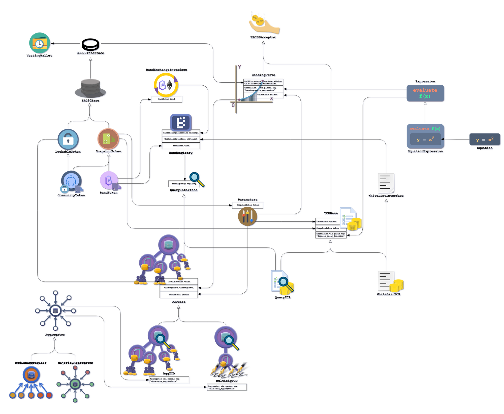

<div align="center">
  <h1>
    Band Smart Contracts
  </h1>

  <p>
    <strong>Decentralized Data Governance Protocol</strong>


  </p>
</div>

[Band Protocol](https://bandprotocol.com) is a protocol for decentralized data governance. This repository contains the implementation of Band Protocol with [Solidity](https://en.wikipedia.org/wiki/Solidity). We use [Truffle](https://www.trufflesuite.com/) as the development environment for compiling and testing the smart contracts. See [whitepaper](https://bandprotocol.com/static/media/whitepaper-3.0.0.0c24d163.pdf) for more information regarding the high-level ideas of Band Protocol.

## Overview

Band Protocol consists of multiple smart contracts and libraries working together. The figure below summarizes interaction between different smart contracts. Note that clear arrows represent inheritance relationship, while filled arrows represent association (has-a) relationship. See comments at the top of the smart contracts' source codes for more details.



## Line Count

To facilitate those who wonder, we have written a simple line-counting [script](scripts/linecount.sh), which can be executed from the root folder.

```
$ ./scripts/linecount.sh  # as of commit af5428e2
Band's smart contract LOC (excluding /mock folder) ...
Blanks (^\s*$): 245
Pragmas (^pragma.*$): 32
Imports (^import.*$): 75
Comments (^\s*///.*$): 119
Code: 1525
```

## Contributing

We highly encourage participation from the community to help with Band Protocol development. If you are interested in developing with Band Protocol or have suggestion for protocol improvement, please [drop as a line](mailto:connect@bandprotocol.com) or send as a pull request.

## Installation

Make sure you have Node.js and Yarn installed, then:

```
$ yarn install
```

To run unit tests, simply run the truffle test command:

```
$ yarn run truffle test --network test
```

The smart contracts can be deployed using truffle command:

```shell
$ yarn truffle deploy
```
